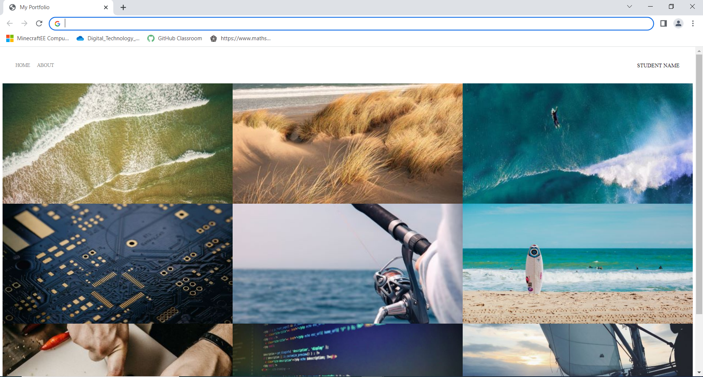
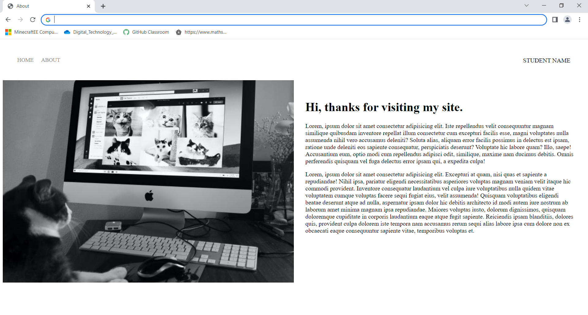
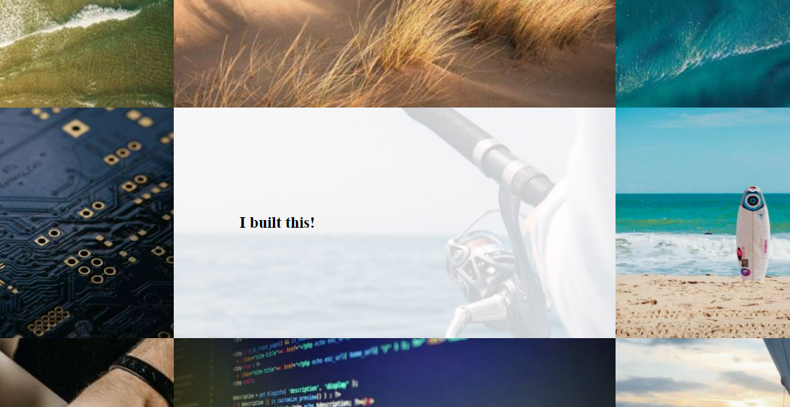

# Web Dev Final Assessment 

Hi Year 10s

This is the Final Assessment for your Web Dev Unit. 

*This task is worth 55% of your mark*

Task/Hei Mahi
You are to create a multi-page website that promotes you! You may either use the design template provided or come up with your oun layout. Your objective is to have a functioning website that will inform your future potential employers about projects that you've done durring your time in high school. 

**Your website must:**
 *	use CSS
 *	have Images optimised for webpages
 *	have a multi-page website that includes images and text
 *	be formatted so that it is easy to read and navigate 
 
**You must: If you choose to re-design**
 *	clear your design plan with the teacher
 *	Use and apply relevant conventions to improve the quality of the outcome.

**Web conventions may include:**
 *	Proper naming of pages and assets (lowercase, hyphens, full names, no spaces)
 *	Fonts – web fonts accessible from all platforms 
 *	Images – appropriate sizes and formats for web and purpose, i.e use of thumbnail images in a gallery, backgrounds removed where applicable. 
 *	Tags – opened and closed correctly, same case throughout.
 *  Heuristic Principles

**You also need to provide evidence showing:**
 *	trialling font and colour combinations
 *	trialling various layouts for text and images
 *	testing that assets/images and pages are linked correctly
 *	testing for consistency of layout and styles

 **You must have one portfolio entry**
*   your entry must document how you built this website
*   your entry must include a short instruction about how you enter an additional project into the website

Below is the provided website design layout your you to follow with all of the styling requirements needed to achieve the same look. 

# Portfolio Home Page

**Navigation Bar**
1. Using Flex Box, position the home and about links on the left side of the page and your name on the right. 
2. Transform your name into all caps using css.
3. Add 38px of padding to the nav-wrapper.
4. On the left side add 20px of padding to the Home and About links. And make all caps using css.
4. Make the height of the nav-link-wrapper 22px and add a bottom border 1px solid black.
5. Change the color of the links, home and about, to #8a8a8a. Remove all text decoration. 

**Image Grid**
1. Make a 3 x 3 Grid of images with no padding no margin. 
2. The grid row needs to me a minimum size of 100px.
3. Image height should be 350px with a width of 100%.
4. The images should not repeat, should be centered in the grid box, and cover the entire box.

# Portfolio About Page

1. Must include a navigation bar wiht student name on the left
2. Make page layout two columns, image on the left and content on the right.
3. Make the image 100% width.
4. Add 30px of padding to the content on the right.
5. Add an h1 header with color black.

# Portfolio Hover State Project Link

1. In html the project image needs to be an active link to the project page.
2. When mouse over there needs to be a hover state with the following settings:
    - hover - opacity: 0.2
    - subtitle - transition of 1s color: transparent
    - subtitle - hover color black, font weight 900, font size XL

# Portfolio Project Entry

1. Must include a navigation bar wiht student name on the left
2. Make page layout two columns, alternating image and content.
3. Project images need a height of 350px and 100% width.
4. Project images need to cover the space given centered in the column and not repeat.
5. Content text alignment needs to be justified. 
6. Content and image together should have a margin of 3em.

# Live Website

Follow the link below to see this website live.

https://mrhollykkhs.github.io/